# CreditRisk360 — CEMAC Credit Intelligence & Risk Analytics Platform


**▶ [Démo en ligne](https://credit-risk360-smoky.vercel.app/)** · Données 100 % synthétiques · Projet personnel, non affilié à une institution

> ⚠️ **Bantu Scoring SA** est une entité fictive, sans lien avec une société réelle, créée uniquement pour les besoins de la démonstration. Aucun portefeuille bancaire réel ni aucune donnée client réelle n'est utilisé. Date de référence unique : `2026-08-31`.

Plateforme web d'analyse du risque de crédit pour la zone **CEMAC** (Cameroun,
Centrafrique, Congo, Gabon, Guinée équatoriale, Tchad) : CreditRisk360 transforme
un portefeuille synthétique d'emprunteurs et de prêts en KPI, scores explicables,
alertes précoces et rapports PDF — projet portfolio **Business Analyst / Data
Analyst** dans un contexte inspiré d'un bureau de crédit.

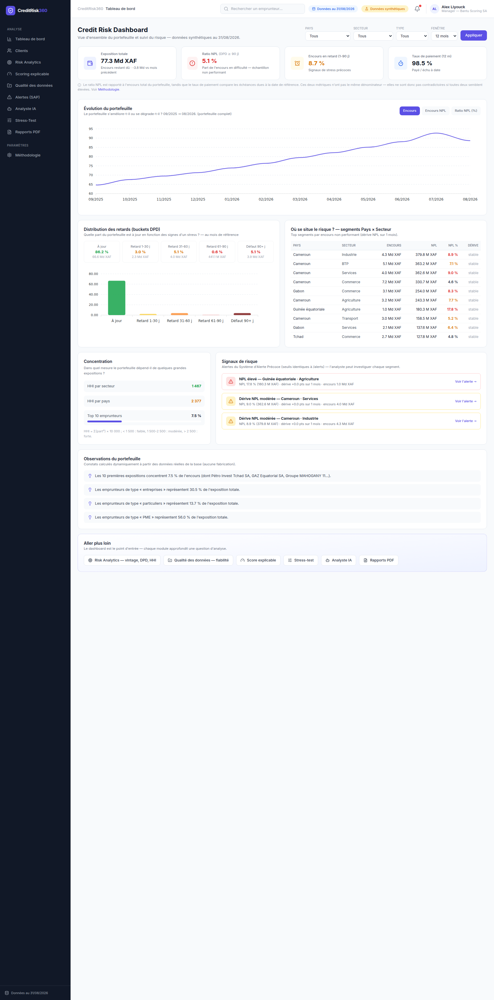

## Résultats clés (scénarios réellement injectés par le seed)

- **Dérive du segment BTP Cameroun (S1)** — retards de 35 à 75 j sur les prêts
  récents (540 facilités) : le moteur SAP détecte la dérive et l'attribue
  (« Pourquoi ? » : nouveaux prêts < 6 mois, restructurés, structurel).
- **Dépassements de limites au Tchad (S2)** — un emprunteur unique à ~5,2 % de
  l'encours (limite 2 %) et le secteur Mines & Pétrole à ~26 % de l'exposition
  du pays (limite 25 %) : statuts « DÉPASSEMENT » dans Risk Analytics.
- **Cohortes 2025 dégradées (S3)** — fréquence de défaut ~2× celle des cohortes
  2023-2024, observable sur les courbes vintage et la heatmap.
- **10 anomalies de qualité de données (DQ-01…DQ-10)** plantées : dates
  manquantes, doublons d'emprunteurs, encours négatifs, échéance antérieure à
  l'octroi, statut CLOSED avec encours, DPD incohérent, paiements postérieurs à
  la date de référence… suivies par un workflow de résolution.
- **5 profils de démonstration** : emprunteur sain, sous surveillance, en défaut,
  multi-institutions et nouveau client — fiches 360° avec historique 36 mois.

## Compétences mises en œuvre

SQL (8 tables, 4 vues métier) · définition de KPI canoniques · qualité des
données · scoring explicable · concentration & limites réglementaires ·
visualisation analytique (ApexCharts) · tests pytest · déploiement Flask /
PostgreSQL-Supabase / Vercel.

## 🚀 Démarrage rapide

```bash
git clone https://github.com/aliyouck2018/CreditRisk360.git && cd CreditRisk360
make setup            # venv + dépendances + schéma + données synthétiques
python run.py         # → http://localhost:5000
```

Base de données : tout PostgreSQL 14+ (local ou **Supabase**) via `DATABASE_URL`
du fichier `.env` (voir `.env.example`).

---

## 1. Aperçu du produit

CreditRisk360 transforme des données de crédit synthétiques en décisions :
**DONNÉES → KPI → SCORING → ALERTE → ACTION**.

L'application aide un analyste crédit à répondre à des questions telles que :

- Quelle est l'exposition du portefeuille ? Où est le NPL ? Comment évolue-t-il ?
- Quels emprunteurs sont sains, sous surveillance ou en défaut — et pourquoi ?
- Quels segments (pays × secteur × taille) se dégradent en ce moment ?
- Où sont les concentrations qui violent les limites réglementaires (25 % / 2 %) ?
- Que se passe-t-il si le taux de défaut augmente de 30 % ou les taux de +3 pts ?
- La qualité des données qui alimentent tout cela est-elle fiable ?

### Démarche analytique (démo)

```
Dashboard (NPL en dérive)
  → Risk Analytics (vintage, DPD, concentration HHI)
    → Alertes SAP (segment dégradé + facteurs explicatifs)
      → Fiche Emprunteur 360° (score explicable, historique 36 mois)
        → Stress-Test (chocs défauts / taux / secteur)
          → Analyste IA (exploration analytique en langage naturel)
            → Rapport de crédit PDF (ReportLab A4)
```

## 2. Fonctionnalités

- **Tableau de bord exécutif** — 4 KPI (exposition, ratio NPL, encours en
  retard 1-90 j, taux de paiement) avec comparaison au mois précédent,
  évolution encours/NPL à bascule de métrique, buckets DPD, segments
  Pays × Secteur classés par NPL, concentration (HHI + Top 10), signaux de
  risque et observations calculées dynamiquement à partir des données.
- **Fiche Emprunteur 360°** — recherche + filtres (pays, secteur), pagination,
  score 300-850 décomposé en points vs profil moyen, bandeau interactif de
  36 mois d'historique (DPD coloré), facilités, consultations bureau de crédit.
- **Risk Analytics** — tranches DPD, analyse vintage par cohorte trimestrielle
  (courbes MOB + heatmap de défaut cumulé), indice HHI, suivi des limites
  réglementaires (secteur ≤ 25 % du pays, emprunteur unique ≤ 2 %) avec
  statuts OK / VIGILANCE / DÉPASSEMENT.
- **Qualité des données** — 10 règles automatisées (DQ-01…DQ-10), score global
  sur 4 dimensions (Complétude, Validité, Unicité, Cohérence), workflow
  *Détecté → En investigation → Corrigé* avec corrections automatiques et
  bouton « Relancer la validation » (recalcul en direct).
- **Alertes (SAP)** — détection des dérives par segment, niveaux
  HIGH / MEDIUM, panneau « Pourquoi ? » attribuant en % la dégradation.
- **Scoring explicable (W1)** — formule canonique
  `Score = 300 + 550 × Σ(Poidsᵢ × Sous-scoreᵢ)`. *Les pondérations sont fixées
  manuellement (non calibrées par apprentissage automatique), cohérent avec
  l'objectif d'explicabilité plutôt que de précision prédictive.*
- **Stress-Test (W2)** — chocs paramétrables (défaut général 0-100 %, hausse
  des taux 0-5 pts, choc sectoriel ciblé) → NPL et Perte Attendue Base vs
  Stress recalculés en direct (API JSON + graphique).
- **Analyste IA (W3)** — questions en français → SQL en lecture seule :
  `SELECT` uniquement, vues `v_*` uniquement, `LIMIT 500` imposé, catalogues
  système interdits, explication ≤ 120 mots en français. *Le moteur NL2SQL est
  un traducteur heuristique par règles (pas un LLM) — remplaçable par un LLM
  distant via clé API (OpenAI/Anthropic) sans changer les garde-fous.*
- **Rapports PDF** — fiches de crédit A4 professionnelles (ReportLab +
  Matplotlib), mention « DONNÉES SYNTHÉTIQUES », exports par emprunteur ou
  centralisés depuis la page Rapports.

## 3. Architecture

```
CreditRisk360/
├── app/
│   ├── __init__.py            # app factory + filtres Jinja + blueprints
│   ├── metrics.py             # définitions canoniques des KPI (source de vérité)
│   ├── routes/                # 9 blueprints (pages + API /api)
│   ├── services/              # scoring · DQ · NL2SQL · rapports PDF · dashboard
│   ├── templates/             # Jinja2 (design system AuditOS)
│   └── static/
├── config.py                  # AS_OF_DATE, limites réglementaires, DSN
├── schema.sql                 # 8 tables + 4 vues métier (Supabase-compatible)
├── seed_supabase.py           # générateur déterministe (SEED=42) + scénarios
├── api/index.py               # point d'entrée Vercel (serverless)
├── tests/                     # pytest (KPI, garde-fous IA, workflow DQ)
├── docs/                      # cahier des charges · captures d'écran (docs/img)
├── run.py · Makefile · vercel.json · requirements.txt · .env.example
```

## 4. Stack technique

| Couche | Choix |
|---|---|
| Backend | Python 3.12+, Flask 3 (App Factory, Blueprints), Jinja2 |
| Base de données | PostgreSQL (Supabase), accès `psycopg2`, agrégations SQL |
| Frontend | HTML5, Tailwind CSS, Alpine.js, ApexCharts, Lucide — sans framework |
| Rapports | ReportLab + Matplotlib (A4, français) |
| Tests | pytest |
| Divers | python-dotenv, gunicorn-compatible, Vercel-ready |

## 5. Modèle de données

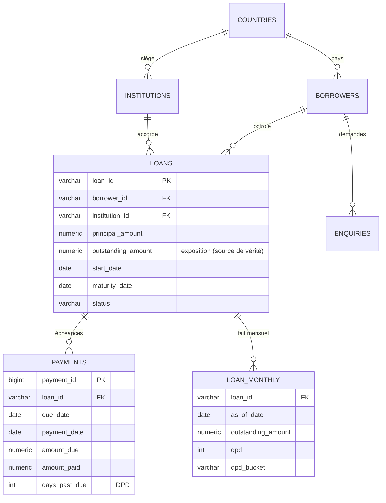

Vues métier : `v_loans_enriched` (prêts enrichis), `v_kpi_monthly` (KPI
mensuels), `v_segment_monthly` (Pays × Secteur × Taille), `v_borrower_metrics`
(entrée du moteur de score).

## 6. Décisions d'analyse

- **Exposition = encours restant dû** (`outstanding_amount`), pas le capital
  initial — c'est l'argent effectivement exposé au défaut aujourd'hui, base de
  tous les ratios (NPL, HHI, limites).
- **Seuil de défaut à 90 jours de DPD** : au-delà, la probabilité de recouvrement
  chute fortement ; 90 j est le standard réglementaire le plus courant et reste
  un choix explicite de la démonstration (ajustable).
- **Taux de paiement** = payé / échu *à la date de référence* : dénominateur
  différent de l'exposition — ces deux indicateurs ne sont pas contradictoires.
- **Dossier vierge** : 0 retard sur 24 mois, aucun impayé, aucun défaut, aucune
  restructuration — référence « fraîche » du scoring.
- **Limites 25 % / 2 %** : seuils usuels de surveillance bancaire
  (concentration sectorielle et de gros risques) implémentés avec 3 statuts
  (OK / VIGILANCE / DÉPASSEMENT) pour reproduire un suivi réel.

### Extraites SQL réelles

Calcul du ratio NPL au mois de référence (vue `v_kpi_monthly`) :

```sql
SELECT to_char(as_of_month, 'MM/YYYY') AS m,
       SUM(total_outstanding) AS encours,
       SUM(npl_outstanding)   AS npl,
       ROUND(SUM(npl_outstanding) / NULLIF(SUM(total_outstanding), 0) * 100, 2) AS npl_ratio
FROM v_segment_monthly
WHERE as_of_month = (SELECT MAX(as_of_month) FROM v_segment_monthly)
GROUP BY 1;
```

Taux de défaut évènementiel sur 12 mois (`loan_monthly`) :

```sql
WITH active_12m AS (SELECT DISTINCT loan_id FROM loan_monthly
                    WHERE as_of_date < CURRENT_DATE - INTERVAL '1 year'),
     crossed AS (SELECT DISTINCT loan_id FROM loan_monthly
                 WHERE as_of_date >= CURRENT_DATE - INTERVAL '1 year' AND dpd >= 90)
SELECT COUNT(*) FILTER (WHERE loan_id IN (SELECT loan_id FROM active_12m))::float
       / NULLIF((SELECT COUNT(DISTINCT loan_id) FROM active_12m), 0) * 100 AS default_rate_12m
FROM crossed;
```

Exposition par segment (Pays × Secteur) — entrée du moteur d'alertes :

```sql
SELECT b.country, b.sector,
       SUM(lm.outstanding_amount) AS encours,
       SUM(CASE WHEN lm.dpd >= 90 THEN lm.outstanding_amount ELSE 0 END) AS npl
FROM loan_monthly lm
JOIN loans l USING (loan_id)
JOIN borrowers b ON b.borrower_id = l.borrower_id
WHERE date_trunc('month', lm.as_of_date) = %(m)s
GROUP BY 1, 2
ORDER BY npl DESC;
```

## 7. Définitions canoniques des indicateurs

| Indicateur | Définition stricte |
|---|---|
| **Exposition** | Encours restant dû (`loans.outstanding_amount`), jamais le capital initial |
| **Ratio NPL** | Encours des prêts avec DPD ≥ 90 j / encours total actif |
| **Taux de défaut 12 m** | Prêts franchissant 90 j de retard sur les 12 derniers mois / actifs 12 mois plus tôt |
| **Taux de paiement** | Σ montants payés / Σ montants échus à la date de référence |
| **Dossier vierge** | 0 retard sur 24 mois, aucun impayé, aucun défaut, aucune restructuration |
| **Concentration (HHI)** | `Σ sᵢ² × 10 000` ; limites : secteur ≤ 25 % du pays, emprunteur ≤ 2 % |

Toutes les formules sont implémentées dans [`app/metrics.py`](app/metrics.py)
et documentées dans la page **Méthodologie** de l'application.

## 8. Installation détaillée

Le `make setup` enchaîne les étapes ci-dessous — commandes granulaires :

```bash
python3 -m venv .venv && source .venv/bin/activate
pip install -r requirements.txt
psql "$DATABASE_URL" -f schema.sql               # tables + vues
python seed_supabase.py --dsn "$DATABASE_URL"    # données synthétiques SEED=42
```

`.env` attendu (copier depuis `.env.example`) :

```env
SECRET_KEY=change-me
DATABASE_URL=postgresql://...
```

## 9. Déploiement Supabase

Le schéma est 100 % compatible Supabase (aucun code spécifique) :

```bash
DATABASE_URL='postgresql://postgres.<ref>:<password>@aws-0-<region>.pooler.supabase.com:6543/postgres'
psql "$DATABASE_URL" -f schema.sql
python seed_supabase.py --dsn "$DATABASE_URL"
```

Le pooler PgBouncer de Supabase supporte le `COPY ... FROM STDIN` utilisé par
le seed (~790 k lignes en ~1 min). Sur **Vercel**, définir `DATABASE_URL`
(pooler) + `SECRET_KEY` en variables d'environnement.

## 10. Génération de données

```bash
python seed_supabase.py --dsn "$DATABASE_URL"
```

Cartes entre le générateur et ce que montrent les écrans :

- **12 021 emprunteurs** au total = 12 000 générés + 6 profils de démonstration
  (sain, sous surveillance, en défaut, multi-institutions, nouveau) + doublons
  plantés pour la règle DQ-02 — expliquant l'écart avec le « 12 000 » nominal.
- **20 000 facilités** = 15 771 actives et 2 615 clôturées + 429 en défaut +
  299 annulées + etc. (le « 20 000 » nominal inclut tous les statuts, le
  dashboard affiche 16 771 actives et 2 519 clôturées pour la période filtrée).
- **378 255 échéances de paiement** (~400 k demandées) et autant de faits
  mensuels `loan_monthly` couvrant les 24 derniers mois.
- **15 917 consultations bureau de crédit** (enquiries).
- Pistes explicables : la base de démonstration respecte l'échantillon nominal ;
  les écarts proviennent des scénarios S1/S2/S3 et des anomalies DQ injectées
  volontairement (activités, statuts fermés, doublons).
- Corrélations réalistes : montant selon la taille, taux 6,5-14,5 %,
  amortissement mensuel, dérive comportementale par cohorte.
- Reproductible : même `SEED` (42) ⇒ mêmes données.

## 11. Garde-fous Analyste IA

```text
SELECT * FROM v_kpi_monthly            → ✅
SELECT * FROM pg_tables                → ❌ catalogue système
DROP TABLE x                           → ❌ non-SELECT
UPDATE loans SET ...                   → ❌ non autorisé
SELECT * FROM countries                → ❌ hors vues v_*
```

`LIMIT 500` imposé automatiquement ; explication générée côté serveur en
≤ 120 mots en citant exclusivement les chiffres retournés.

## 12. Tests

```bash
make test
```

7 tests : cohérence des KPI canoniques (NPL recalculé indépendamment), absence
de données postérieures à la date de référence, garde-fous de l'Analyste IA
(SELECT-only, vues `v_*`, LIMIT 500), workflow de résolution DQ et correction
automatique, conformité des pages (routes en 200).

## 13. Limites connues

- L'authentification est volontairement absente (MVP portfolio) ; l'utilisateur
  affiché (« Alex Liyouck, Manager ») est statique et fictif.
- Les pondérations du score sont fixées manuellement (objectif d'explicabilité,
  pas de précision prédictive).
- L'Analyste IA utilise un traducteur heuristique déterministe (français → SQL)
  ; un LLM distant (OpenAI/Anthropic) peut le remplacer via la clé API.

## 📸 Captures d'écran

<details>
<summary><b>Voir toutes les captures d'écran</b> (9 modules)</summary>

### Emprunteurs (fiche 360°)
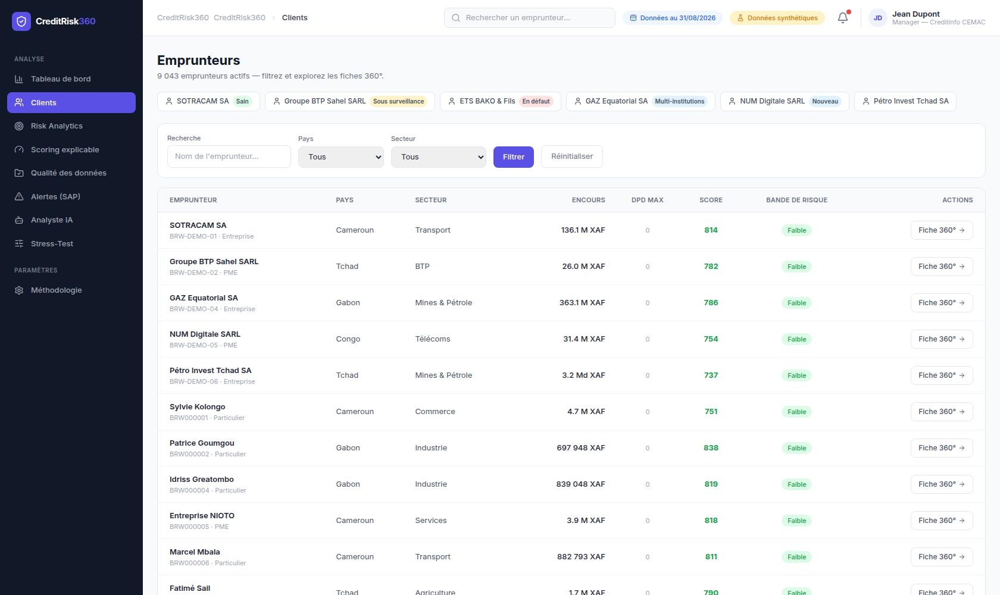

### Fiche Emprunteur (score explicable + historique 36 mois)
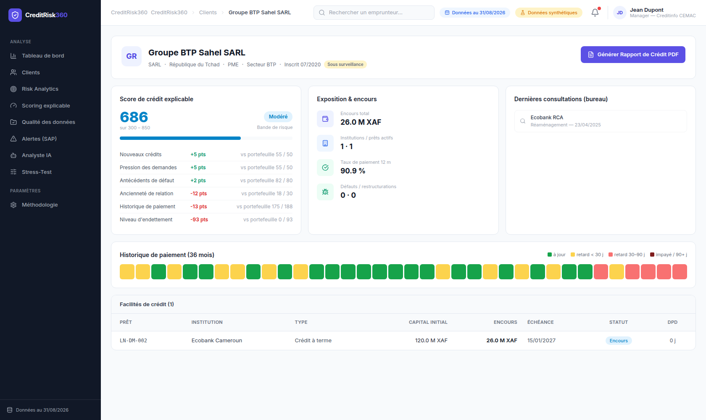

### Risk Analytics
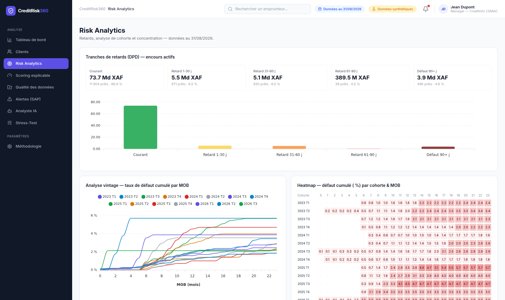

### Qualité des données
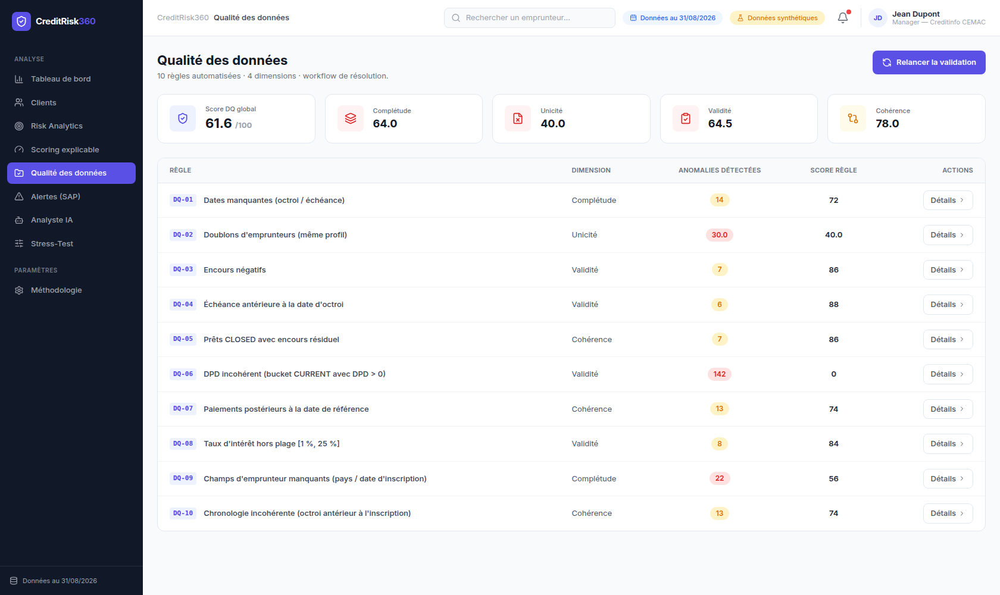

### Alertes SAP
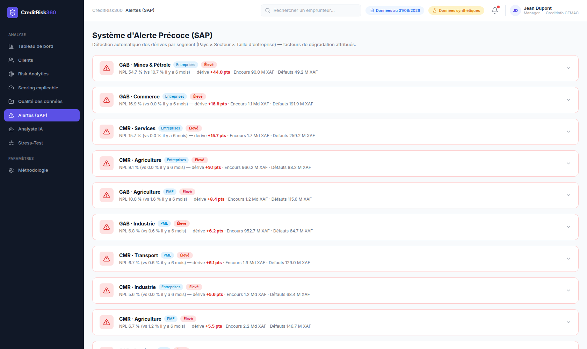

### Scoring explicable
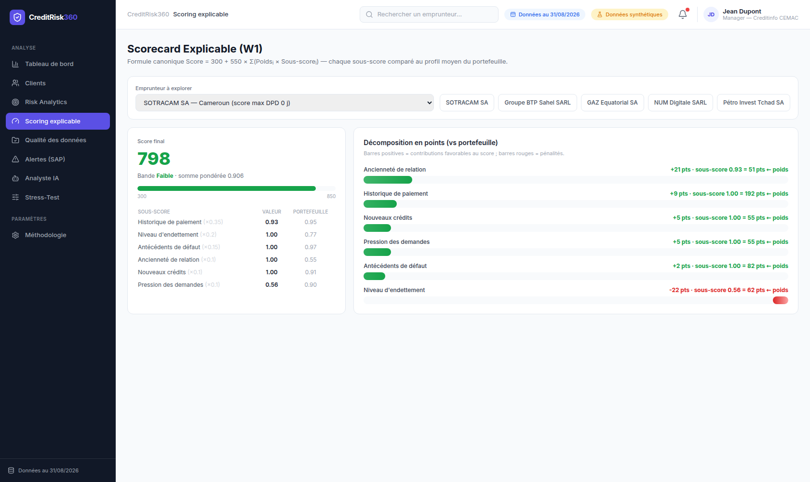

### Stress-Test
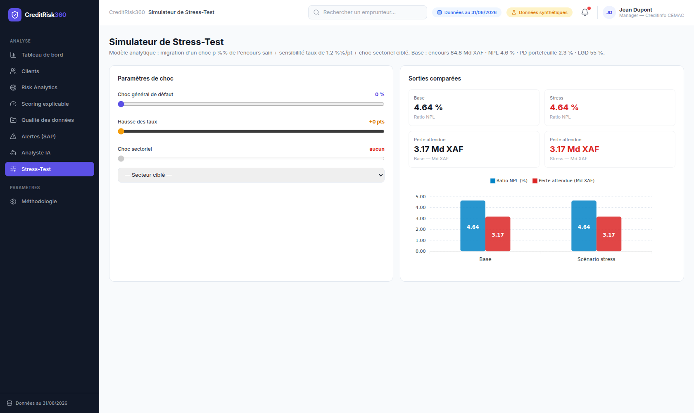

### Analyste IA
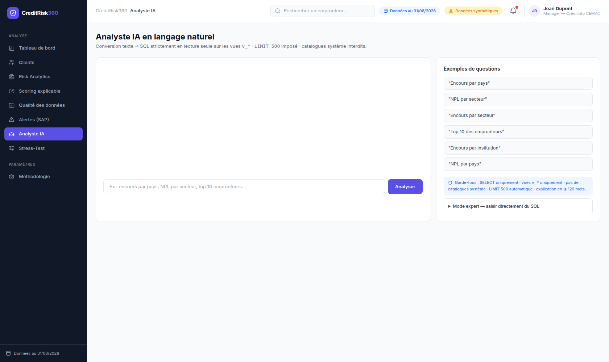

### Méthodologie pédagogique
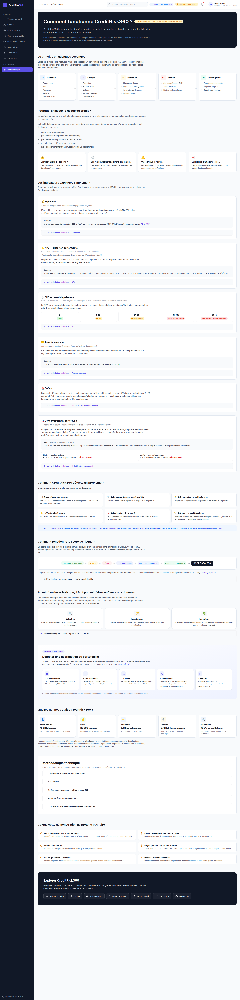

</details>
